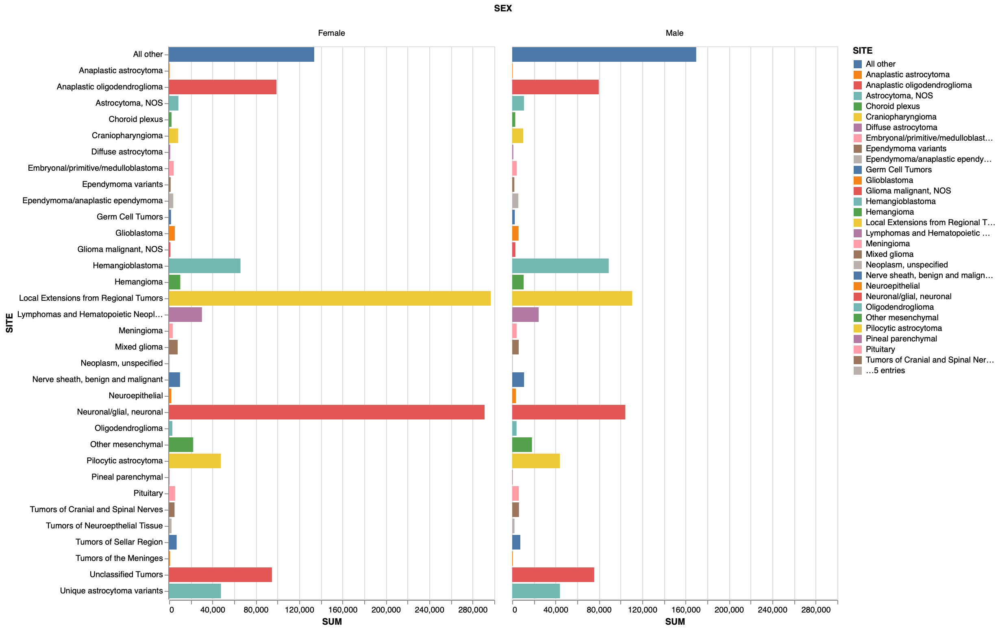

CS625-HW8: Project - Implement Final Chart
================
Priyanka Vepuri
12/10/2021

## Centers for Disease Control and Prevention - United States Cancer Statistics (USCS)

#### Link: [Dataset](https://www.cdc.gov/cancer/uscs/dataviz/download_data.htm)

These datasets provide Cancer Statistics data from the year 1999 to
2017. Out of the eleven datasets present for various groups of Cancer,
here we will observe the visualization for Brain Cancers by Tumor Type.

Dataset **data** provides the affected patients by brain cancer from the
year 2004 to 2017. The data also gives us the details of persons
affected based on their gender and age.

#### Link: [Observable Notebook](https://observablehq.com/d/81b70fc213138121)

#### Question asked in HW7 and Headline to the new chart

**Question: What is the average age of a person diagnosed, does it
differ with gender? Which tumor is observed mostly in the population,
and how does it vary with gender?**

After studying the dataset a little more, and feedback from HW7, decided
to focus more on the **Site of a tumor observed mostly in the population
and how it varies for gender?**

#### Draft Chart From HW7

##### Chart created: 

#### Refined Chart: 

**Observation**:-

The headline of the graph says, **" VARIATION OF TUMORS AFFECTED IN EACH
SEX DEPENDING ON THEIR SITE EVERY YEAR"**. It is suitable for the chart
because of each individual chart in the visualization plots the *SITE*
and how it affected males and female from 2004 to 2017. It shows if the
count increased or decreased or if it was steady.

#### Design Decisions

The draft chart plot the count of each Site for male and female
combining for all the years. The data was not filtered with the age
category. It showed bar graphs for each sex neighboring each other for
all the Sites. From this, there was no clear idea of each location and
its impact on the population.

For refined chart, repetition is used for multiple fields. The data
provided consists of *“Total Count”* also all the sites. This field is
removed from the dataset because there is no requirement of showing the
total to answer this question. In the *“YEAR”* column the data for each
year is provided along with the combined data for the year
*“2013-2017”*, as we do not require that count it is filtered out.
Similarly, the **Male/Female** count is present along with their
combined count. As the relation is shown between Male and Female there
is no need for combined *Male and Female* field, thus it is discarded.
The Age group of affected people is divided into two groups, **“0-19”
and “20+”**. To observe the spread of tumor in adults, filtered the data
to only get results of patients who are aged above 20 years.

There are two types of tumors **Benign and Malignant**. Benign tumors
are **noncancerous**, they grow slowly and do not spread, whereas
Malignant tumors are **cancerous** grow rapidly and spread to other
organs and can destroy normal tissues.

To plot each small multiple inside one chart, filtered the data for each
*SITE* and stored it in a different variable. To observe the
*behavior(benign and malignant)* of tumor cause at various location,
filtered the data for Malignant tumor only and we see that out of 34
locations, 5 locations cause benign tumor and rest 29 cause a malignant
tumor. For more accuracy in the visualization, filtered the data for
Malignant tumors only and found that **Choroid\_plexus,
Craniopharyngioma, Ependymoma\_variants, Hemangioblastoma, Hemangioma
are all Benign tumors and are noncancerous**. The tooltip is used to
display the behavior as well as a count of each Site, thus both
behaviors are retained in the final chart.

As the change in the count of people affected is to be observed over the
years, which is nothing but a trend, *markLine* was used. But to display
the count and make it differentiable the size of the mark was supposed
to be altered. For Line, the size does not change with the **size**
parameter. The *markTrail* can be used instead of markLine for showing a
trend and varying its size but with this, the mark the size changes
inside one view with changing value not compared to the whole data.
Another mark that varies with a size parameter is **markCircle**, used
this for the refined chart as this varies over the whole data. For
showing trend using line, *average of COUNT* was used but as Circle is
used the average function is not required and the exact value can be
incorporated straight away.

The *scale* for the size parameter is changed to 50 from 0 because the
mark for very few values was not visible in the chart. For the axis
*“labelAngle: 90”* is used to align the YEAR on the x-axis in a vertical
manner. The width and height are adjusted to accommodate more views in
one row and column than the default. A function is created for each site
and this function is called to plot in repetition using *hconcat and
vconcat*. Concatenation is used to align all the views in one chart and
comparison is made easier and the data is easily readable for any user.
Each multiple is labeled with the *SITE* it belongs to for easier
understanding. The heading is added at the end of the whole graph using
*text, dx, and fontSize parameters*. The text parameters assign the text
to be shown, dx adds a horizontal offset to the title from the borders
of the chart, and fontSize updates the size of the font.

When the tooltip is used for both *Behavior and COUNT* it is observed
that the tumor has a capability of being benign as well as malign for
various sites. For example, from the plot, it is clear that **Tumors of
Neuroepthelial Tissue, Pituitary, Neuronal/glial, Other mesenchymal,
Neoplasm, Unclassified Tumors, Pineal parenchymal, Unique astrocytoma
variants, GLioma malignant NOS, Tumors of Sellar Region** tend towards
being benign/borderline as well as malignant in both male and female
patients. Whereas tumors at sites like **Meningioma, Tumors of the
Meninges, Germ cell Tumors, Tumors of Cranial and Spinal Nerves, Nerve
sheath and the one’s under All Others** tend towards being benign as
well as malignant with *Males*, they behave only in a malignant way for
females. These might as well conclude that the females affected with
these tumors are more prone to cancerous conditions than males.

Meningioma and Tumors of the Meninges are nothing but the same
locations, thus one of the values is discarded to avoid ambiguity. We
can see from the graph that the most location where the tumor is
**affected most is Meningioma**. A meningioma is a tumor that forms on
membranes that cover the brain and spinal cord just inside the skull.
This tumor is found more in females than males, but is always curable in
females, and have found instances of being malignant every year in a
male counterpart.

The second highest tumor observed is **Tumors of Neuroepithelial
tissue** are witnessed in midline locations. This tumor has affected
male counterparts more than the female, and they also tend towards being
cancerous for males. **Glioblastoma** is one of the third-highest tumor
observed and is only malignant i.e, always cancerous for male and female
both. It has been encountered in males more than females, with a
constant rise in this tumor from 2004 to 2017. It is an aggressive type
of cancer that can occur in the brain or spinal cord.

#### Visualization Principles from the semester incorporated into the Final Visualization

A line mark is used to show a trend in the chart. Ordered data and
quantitive data are usually displayed using the line chart, but since
the size was an important factor, a scatter plot is used. As circles,
squares, rectangles are marks that can be used to display size
parameters. The year is used as a Categorical parameter and Count is a
quantitative parameter. Scatter is used as the behavior is also observed
for different sex. Labels are displayed for a user to recognize the
marks. Color is used to display the sex of a person affected. Size is
used to compare the count of the affected people for different Sites.
The scale is used to adjust the size of the circle and make
visualization readable. Tooltip is used for easier display of
information, so the user does not have to look back at the axis or
labels every time.

#### Final Thoughts

I really liked the process of preparing this refined chart. The time I
spent developing the visualization was roughly around 3 days as I went
through the dataset thoroughly and understood the concepts and prepared
my refined chart. I have spent equal amount of my time on each aspect.
There is no particular point or topic that I was worried about.
Splitting up the project into stages was really helpful and less burden
as this is not the only course I am studying. Also, got lots of time to
study the data and understand well as it was separate assignments
instead of 1 big project.

### References:

1.  [Malignant and Benign
    Tumors](https://www.verywellhealth.com/what-does-malignant-and-benign-mean-514240)

2.  [Brain Tumor
    Types](https://braintumor.org/brain-tumor-information/understanding-brain-tumors/tumor-types/)

3.  [Glioblastoma](https://www.mayoclinic.org/diseases-conditions/glioblastoma/cdc-20350148#:~:text=Glioblastoma%20is%20an%20aggressive%20type%20of%20cancer%20that%20can%20occur,%2C%20nausea%2C%20vomiting%20and%20seizures.)

4.  [Concatenating
    View](https://observablehq.com/@observablehq/layers-facets-concat)

5.  [Tumors of Neuro-epithelial
    tissue](https://www.ncbi.nlm.nih.gov/books/NBK13150/#:~:text=Neuroepithelial%20tumors%20are%20further%20subclassified,of%20childhood%20tumors%20are%20infratentorial.)

6.  [Meningioma and Tumors of the
    Meninges](https://www.webmd.com/cancer/brain-cancer/meningioma-causes-symptoms-treatment#1)

7.  [Title of the Chart](https://vega.github.io/vega/docs/title/)

8.  [markCircle with size
    parameter](https://observablehq.com/d/06499f6a4926793f)

9.  [markTrail for
    Size](https://vega.github.io/vega-lite/docs/trail.html)
